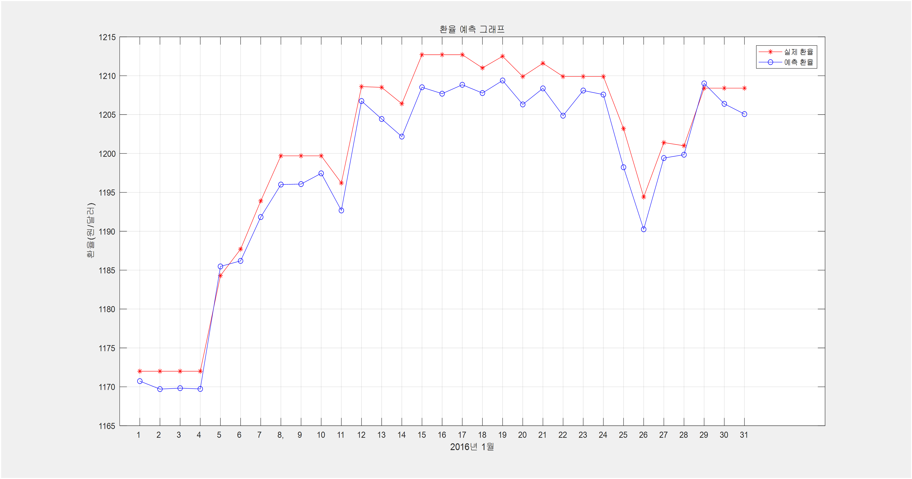
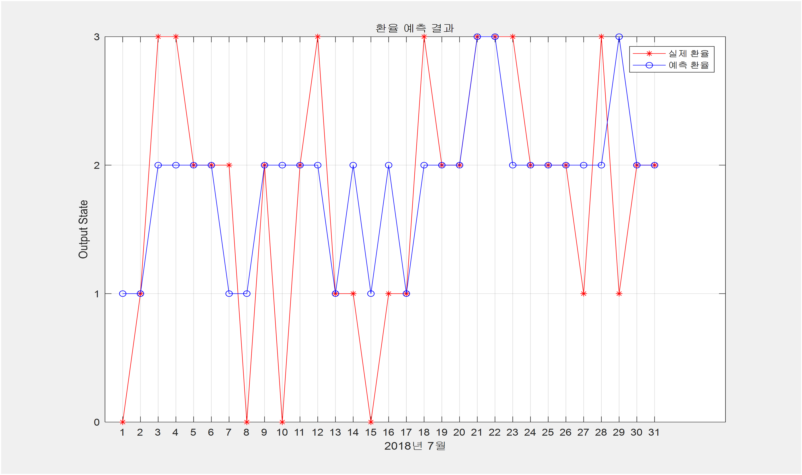

# predictcurrent
졸업 작품, 논문

#### 머신러닝을 활용한 환율 예측 프로그램

Coursera에서 Eng 교수님의 강의를 듣고 머신러닝, 딥러닝 이론에 대해 배웠습니다.  
그 이론들을 활용해서 환율의 변동성을 예측할 수 있는 알고리즘을 팀원들과 함께 개발했습니다.
환율에 영향을 줄 수 있는 feature들을 조사했고 그 feature들의 2005년부터 2017년까지의 데이터를 수집했습니다.
주말, 공휴일 삭제 Interpolation을 활용해 데이터를 가공하여 learning 할 수 있도록 했습니다.
Training Error, Test Error의 차이가 가장 적은 곳을 찾아 결과 값을 도출 했습니다.

 

    
  Linear Regression을 활용한 예측 환율 비교

    
  NeuralNetwork를 활용한 예측 환율 비교

 

>사용 언어 : Matlab  
>이론 :  
>ML / DL  
>Linear Regression, Normal Equation, Learning Curve,  
>Regularization  
>Neural Network  

---
